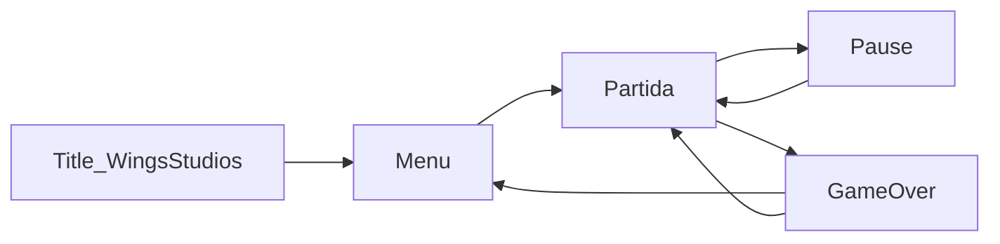

# PRD — Wing Blocks (v0.1)

**Produto:** Wing Blocks  
**Estúdio:** Wings Studios  
**Documento:** Product Requirements Document  
**Status:** Aprovado  
**Público:** Família mista (crianças, adolescentes e adultos), tom familiar

---

## 1. Visão

Wing Blocks é um jogo de puzzle de blocos em queda, **original** (não é Tetris nem usa a marca Tetris), feito para sessões curtas em família: regras simples, ritmo ajustável, power-ups que criam “viradas” sem violência ou conteúdo adulto.

A identidade visual segue o estúdio: azul-marinho, ouro, pixel art heráldico (escudo, asas, halo). O logo em `public/assets/logo_wings_studios.png` entra na tela de título e no splash.

**Promessa:** “Um round de 3–10 minutos que qualquer um da família entende, e power-ups que deixam a última linha dramática.”

---

## 2. Problema e oportunidade

Jogos de bloco clássicos são viciantes, mas para família costumam ser: (a) rígidos demais para crianças, (b) sem “evento” além de limpar linhas, (c) difíceis de jogar no mesmo sofá. Wing Blocks resolve com **dificuldade assistida**, **power-ups visíveis** e **modo cooperativo no mesmo aparelho** (MVP+).

**Restrição legal (obrigatória):** não usar nome, logo, jingle, guideline branding nem “Tetris”. Peças, nomenclatura e arte próprias. Mecânica de queda + linhas é gênero, não marca.

---

## 3. Objetivos (MVP)

| Objetivo | Métrica de sucesso |
|---|---|
| Primeira partida compreensível | Jogador novo completa 1 partida sem tutorial longo (hints in-game) |
| Emoção via power-ups | Pelo menos 1 power-up usado em 80% das partidas de 2+ min |
| Família no mesmo device | Controles teclado + toque; pause sempre visível |
| Manutenibilidade | Regras de jogo testáveis sem Phaser/DOM (Clean Architecture) |

**Fora do MVP:** loja de skins pagas, ranking online, contas, multiplayer pela rede, narrativa longa, editor de peças.

---

## 4. Personas

- **Criança (6–12):** quer cores, asas, “poder especial”, perde se cair muito rápido.
- **Adolescente:** quer combo, hold, next queue, high score.
- **Adulto:** quer partida rápida, pause, volume, “um round com o filho”.

---

## 5. Experiência e loop de jogo

**Loop:** peça entra → jogador move/gira/soft-drop → lock → limpar linhas → pontuar → chance de spawn de power-up → gravidade sobe com o nível → topo cheio = game over.

**Feel:** 60 FPS alvo no desktop; 30+ aceitável em mobile antigo. Sem jumpscare, sem sangue, paleta dourada/azul.

---

## 6. Mecânicas de core (domínio)

- Tabuleiro: **10 colunas × 20 linhas visíveis** (+ buffer oculto de 2 linhas para spawn).
- Peças: 7 formas originais (equivalentes geométricos ao tetrominó, **nomes Wings**: Pluma, Escudo, Asa, Halo, Lança, Cruz, Bloco). Matrizes 4×4 em SPEC-001.
- Rotação: SRS-lite (wall kicks básicos) — SPEC-002.
- Hold (guardar 1 peça), fila **Next** de 3.
- Linhas: 1–4; pontuação crescente (single &lt; double &lt; triple &lt; “Asa Quádrupla”).
- Níveis: linhas acumuladas aumentam nível; gravidade aumenta.
- Game over: spawn inválido.

**Acessibilidade família:** modo **Calma** (gravidade baixa, ghost piece, sem lock delay agressivo) e modo **Clássico**.

---

## 7. Power-ups (emoção)

MVP: **ativação imediata ao limpar linha que contém a relíquia** — mais claro para crianças.

**Set atual (6 poderes, todos familiares):**

1. **Asa de Tempo** — 8s de queda lenta.
2. **Escudo Celeste** — próxima peça que não couber é recusada uma vez (salva o game over uma vez).
3. **Halo** — limpa a linha mais baixa preenchida parcialmente (ajuda a “desentupir”).
4. **Rajada** — remove 2×2 no ponto da peça recém-travada (MVP: automático no lock da peça-relíquia).
5. **Troca de Pluma** — troca a peça atual pela do Hold sem gastar o Hold (ou randomiza Next[0] se Hold vazio).
6. **Golpe Real** — destrói automaticamente a linha ou coluna visível com maior ocupação.

**Regras de fairness:** no máximo 1 poder ativo; cooldown visual; Calma spawna mais relíquias; Clássico spawna menos. Sem PvP tóxico no MVP.

---

## 8. Modos de jogo (priorização)

**P0 — MVP**

- Solo Calma
- Solo Clássico
- Game over + melhor pontuação **local** (`localStorage`)

**P1 — pós-MVP**

- **Asas Juntas:** 2 jogadores, mesmo tabuleiro, turnos ou peças alternadas (coop no sofá)
- Missão diária simples (“limpe 10 linhas com Halo”)

**P2**

- Versus local (dois tabuleiros) — só depois do core estável

---

## 9. UI / branding

- Splash: logo Wings Studios → fade para título **WING BLOCKS**.
- Tipografia pixel / display; UI grande para toque (botões ≥ 48px).
- HUD: pontuação, nível, Next, Hold, ícone de poder ativo, botão pause.
- Controles toque: zona esquerda mover, direita girar, swipe down hard drop (SPEC-007).
- Teclado: setas, Z/X rotação, C hold, espaço hard drop, Esc pause.
- Idioma **pt-BR** no MVP; strings em arquivo i18n para EN depois.

---

## 10. Requisitos não funcionais

- Web/PWA: jogável offline após primeiro load (cache de assets).
- Sem backend no MVP.
- Testes unitários do domínio ≥ regras de lock, linha, poder, game over.
- Código em inglês; docs de produto em português (PRD/specs/ADR).

---

## 11. Plataforma, linguagem e framework

**Web PWA + TypeScript + Phaser 3 + Vite + Vitest.** Menus em Phaser Scene (sem React no MVP). Ver [ADR-0001](../adr/ADR-0001-plataforma-web-ts-phaser.md).

---

## 12. Arquitetura (Clean Architecture)

Camadas **dependem só para dentro**. Phaser **nunca** contém regra de “a linha limpa?”. Ver [ADR-0002](../adr/ADR-0002-clean-architecture.md).

- `src/domain/` — entidades, VOs, regras puras
- `src/application/` — casos de uso, ports (interfaces)
- `src/infrastructure/` — localStorage, adapters Phaser
- `src/presentation/` — scenes, sprites, HUD
- `docs/prd/` — este PRD
- `docs/specs/` — SDD
- `docs/adr/` — decisões
- `tests/domain/` — Vitest

**Regra de ouro:** um tick de gravidade é `application` chamando `domain`; Phaser só desenha o snapshot (`BoardViewState`).

---

## 13. SDD (Specification-Driven Development)

Antes de cada fatia de código: spec → testes que falham → domínio → adapter Phaser.

Specs: SPEC-001 a SPEC-007 em `docs/specs/`.

---

## 14. ADRs

| ID | Decisão |
|---|---|
| ADR-0001 | Web PWA + TypeScript + Phaser 3 + Vite |
| ADR-0002 | Clean Architecture: domínio sem Phaser |
| ADR-0003 | Sem backend no MVP |
| ADR-0004 | Power-ups por relíquia em linha |
| ADR-0005 | Não usar marca Tetris; naming original |

---

## 15. Roadmap de entrega

1. Repo: Vite + TS + Vitest + estrutura CA + ADRs  
2. Domínio jogável em testes (sem gráficos)  
3. Scene de jogo Phaser + HUD + logo  
4. Power-ups + modos Calma/Clássico  
5. PWA (manifest, ícones Wings) + polish áudio/SFX  
6. Playtest família → ajustes de gravidade e spawn de relíquia  

---

## 16. Riscos

- **Marca Tetris:** mitigado por naming/arte/copy.  
- **Toque ruim:** mitigado por spec de input e playtest em telefone real.  
- **Phaser vazando no domínio:** mitigado por testes que importam só `src/domain`.  
- **Power-up injusto (Rajada):** se playtest reclamar, vira confirmação ou só no Calma.

---

## 17. Critérios de aceite do MVP

- Partida completa nos dois modos, game over, recorde local.  
- 6 power-ups documentados e jogáveis.  
- Logo Wings Studios na title.  
- Nome **Wing Blocks** em toda UI.  
- Controles teclado + toque.  
- Testes de domínio cobrindo lock, linhas, um poder, game over.  
- ADR-0001 a 0005 escritos.
