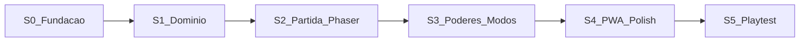

# Plano de sprints — Wing Blocks MVP

**Produto:** Wing Blocks  
**Cadência:** 1 semana por sprint (família / tempo parcial: ~8–12 h)  
**Método:** spec → testes → domínio → Phaser  
**Status:** Sprints 0–5 entregues (MVP fechado no código; playtest presencial com o roteiro da Sprint 5)

Fora deste plano (P1/P2): Asas Juntas, missões diárias, versus local.

---

## Sprint 0 — Fundação (feito)

**Objetivo:** repo, governança e título.

- PRD, ADR-0001–0005, SPEC-001–007
- Vite + TypeScript + Phaser + Vitest + pastas CA
- Logo Wings Studios na TitleScene
- Peças no domínio + port de recorde

**Pronto quando:** `npm test` passa; `npm run dev` mostra WING BLOCKS.

---

## Sprint 1 — Domínio jogável (sem gráficos)

**Specs:** SPEC-001, SPEC-002, SPEC-003 (núcleo)  
**Objetivo:** partida completa só em testes.

| Item | Detalhe |
|---|---|
| Tabuleiro | 10×20 + buffer, células, colisão |
| Spawn | 7 peças, fila Next 3, bag/RNG injetável |
| Ações | move, rotate SRS-lite, soft/hard drop, lock, hold |
| Linhas | limpar, compactar, score, nível, game over |
| Use cases | `StartGame`, `Tick`, `Move`, `Rotate`, `HardDrop`, `Hold` em `application` |
| Snapshot | `BoardViewState` para a Sprint 2 |

**Não entra:** Phaser além do que já existe; power-ups; input.

**Aceite:** testes de lock, linhas, spawn inválido = game over. Nenhum `import "phaser"` em domain/application.

---

## Sprint 2 — Partida visível + HUD + input

**Specs:** SPEC-007; wiring SPEC-001–003  
**Objetivo:** jogar Calma *ou* Clássico na tela (um modo default ok se o outro for stub visual).

| Item | Detalhe |
|---|---|
| Fluxo | Title → Menu (Calma/Clássico) → Play → Pause → Game Over |
| Render | tabuleiro, ghost, Next, Hold, score, nível |
| Teclado | setas, Z/X, C, espaço, Esc (DAS/ARR) |
| Toque | zonas + swipe down + botões ≥ 48px |
| i18n | strings pt-BR |

**Não entra:** os 5 poderes jogáveis (HUD pode ter slot vazio).

**Aceite:** uma partida no teclado e uma no toque até game over; pause congela o tick.

---

## Sprint 3 — Power-ups e modos

**Specs:** SPEC-004, SPEC-005  
**Objetivo:** emoção familiar + dois ritmos.

| Item | Detalhe |
|---|---|
| Relíquia | spawn por taxa Calma/Clássico; célula dourada |
| Poderes | Asa de Tempo, Escudo Celeste, Halo, Rajada, Troca de Pluma |
| Fairness | um poder ativo; HUD ícone + timer |
| Gravidade | tabelas Calma vs Clássico; Asa força tick Calma nv.1 |

**Aceite:** os 5 poderes cobertos por teste de domínio + visíveis in-game; Calma mais lenta e com mais relíquias que Clássico.

---

## Sprint 4 — Recorde, PWA e polish

**Specs:** SPEC-006; PRD §9–10  
**Objetivo:** “abrir o link e jogar / instalar”.

| Item | Detalhe |
|---|---|
| Recorde | `saveIfBest` no game over, por modo |
| PWA | manifest, ícones a partir do logo, service worker cache de assets |
| Áudio | SFX lock/linha/poder + mute no pause |
| Arte | blocos paleta navy/ouro; sem marca alheia |

**Aceite:** recorde sobrevive a F5; installable; mudo funciona; copy só Wing Blocks / Wings Studios.

---

## Sprint 5 — Playtest família (fechamento MVP)

**Objetivo:** critérios de aceite do PRD §17.

| Item | Detalhe |
|---|---|
| Sessão | criança + adolescente + adulto, 1 partida cada modo |
| Ajustes | gravidade, taxa de relíquia, Rajada se injusta |
| Bugs | input toque, game over fantasma, poder preso |
| DoD | checklist MVP ticked |

**Aceite do produto:** partida nos dois modos, 5 poderes, logo, nome, teclado+toque, testes de lock/linhas/um poder/game over, ADRs já escritos.

---

## Dependências e riscos por sprint

| Sprint | Risco | Mitigação |
|---|---|---|
| 1 | Rotação/kick incompleta | testes de parede antes da UI |
| 2 | Toque ruim | SPEC-007 + telefone real no aceite |
| 3 | Rajada frustra | restringir a Calma se playtest (S5) pedir |
| 4 | SW quebra HMR | SW só em `vite build` |
| 5 | Escopo P1 vaza | Asas Juntas só depois do DoD |

---

## Ordem de trabalho na Sprint 1 (próxima)

1. Testes SPEC-001 (tabuleiro + spawn + game over)  
2. Testes SPEC-002 (move/rotate/lock/hold)  
3. Testes SPEC-003 (linhas + score + nível)  
4. Implementar domínio até verde  
5. Casos de uso em `application` + `BoardViewState`  
